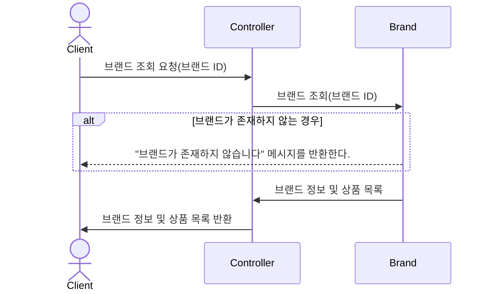
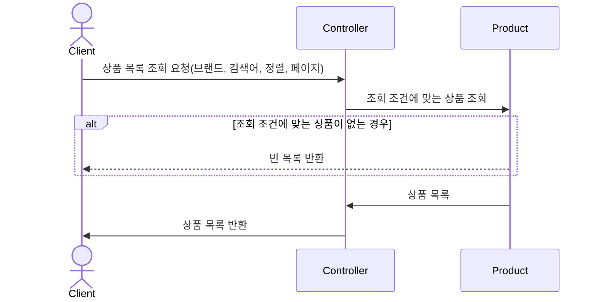
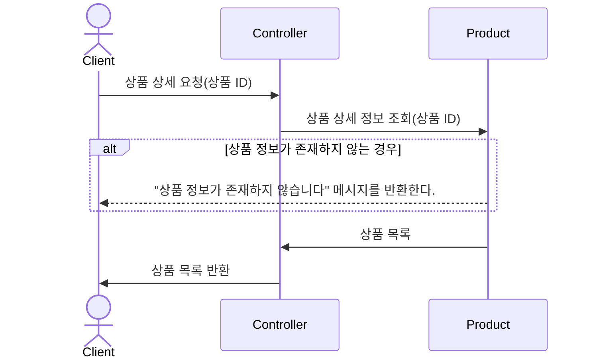
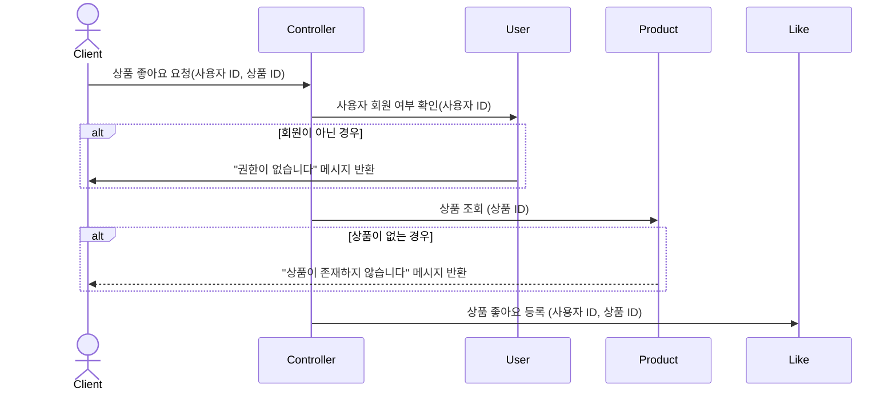
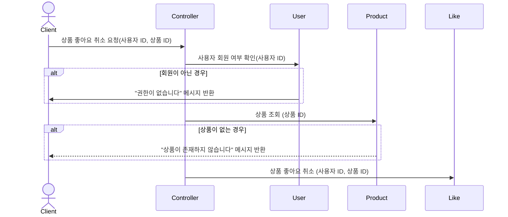
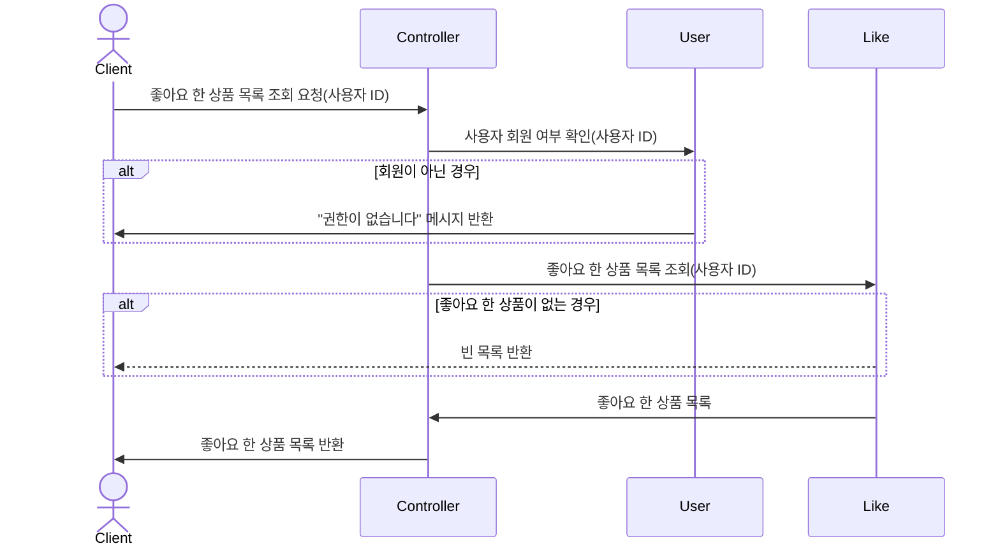
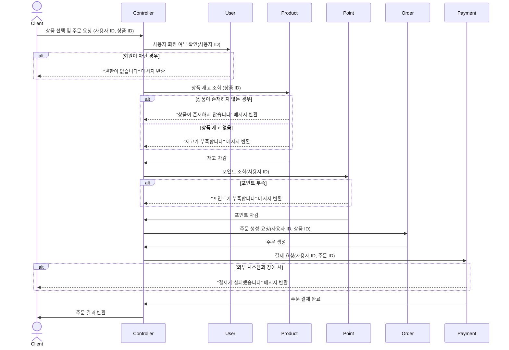
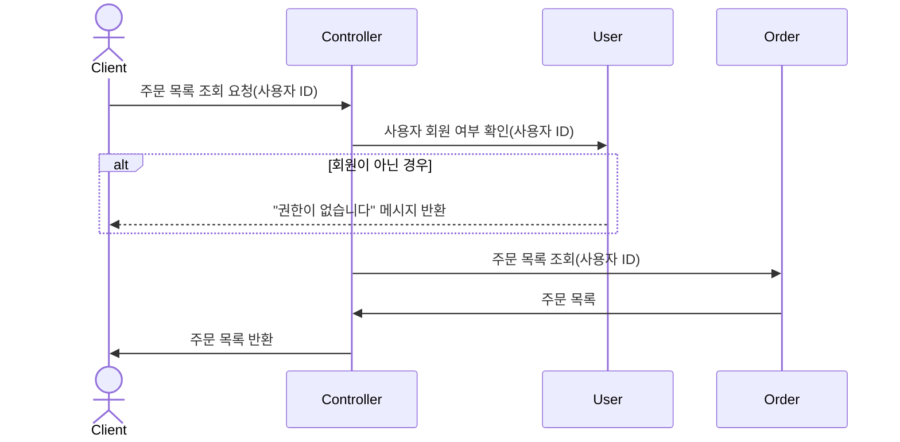
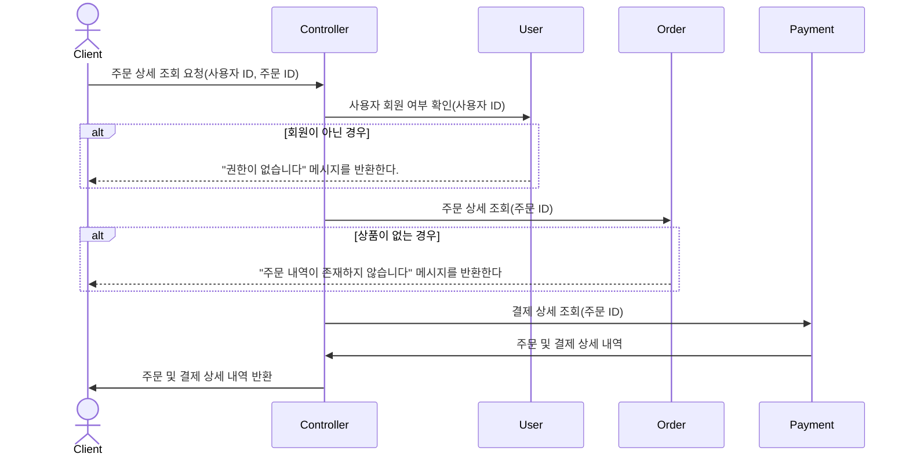

# 시퀀스 다이어그램

---

## 브랜드 조회

```mermaid
sequenceDiagram
    actor Client
    participant Controller
    participant Brand
    
    Client ->> Controller: 브랜드 조회 요청(브랜드 ID)
    Controller ->> Brand: 브랜드 조회(브랜드 ID)
    alt 브랜드가 존재하지 않는 경우
        Brand -->> Client: "브랜드가 존재하지 않습니다" 메시지를 반환한다.
    end
    Brand ->> Controller: 브랜드 정보 및 상품 목록
    Controller ->> Client: 브랜드 정보 및 상품 목록 반환
```

---

## 상품 목록 조회

```mermaid
sequenceDiagram
    actor Client
    participant Controller
    participant Product
    
    Client ->> Controller: 상품 목록 조회 요청(브랜드, 검색어, 정렬, 페이지)
    Controller ->> Product: 조회 조건에 맞는 상품 조회
    alt 조회 조건에 맞는 상품이 없는 경우
        Product -->> Client: 빈 목록 반환
    end
    Product ->> Controller: 상품 목록
    Controller ->> Client: 상품 목록 반환
```

---

## 상품 상세 조회

```mermaid
sequenceDiagram
    actor Client
    participant Controller
    participant Product
    
    Client ->> Controller: 상품 상세 요청(상품 ID)
    Controller ->> Product: 상품 상세 정보 조회(상품 ID)
    alt 상품 정보가 존재하지 않는 경우
        Product -->> Client: "상품 정보가 존재하지 않습니다" 메시지를 반환한다.
    end
    Product ->> Controller: 상품 목록
    Controller ->> Client: 상품 목록 반환
```

---

## 상품 좋아요

```mermaid
sequenceDiagram
    actor Client
    participant Controller
    participant User
    participant Product
    participant Like
    
    Client ->> Controller: 상품 좋아요 요청(사용자 ID, 상품 ID)
    Controller ->> User: 사용자 회원 여부 확인(사용자 ID)
    alt 회원이 아닌 경우
    User ->> Client: "권한이 없습니다" 메시지 반환
    end
    Controller ->> Product: 상품 조회 (상품 ID)
    alt 상품이 없는 경우
    Product -->> Client: "상품이 존재하지 않습니다" 메시지 반환
    end
    Controller ->> Like: 상품 좋아요 등록 (사용자 ID, 상품 ID)
```

---

## 상품 좋아요 취소

```mermaid
sequenceDiagram
    actor Client
    participant Controller
    participant User
    participant Product
    participant Like
    
    Client ->> Controller: 상품 좋아요 취소 요청(사용자 ID, 상품 ID)
    Controller ->> User: 사용자 회원 여부 확인(사용자 ID)
    alt 회원이 아닌 경우
    User ->> Client: "권한이 없습니다" 메시지 반환
    end
    Controller ->> Product: 상품 조회 (상품 ID)
    alt 상품이 없는 경우
    Product -->> Client: "상품이 존재하지 않습니다" 메시지 반환
    end
    Controller ->> Like: 상품 좋아요 취소 (사용자 ID, 상품 ID)
```

---

## 좋아요 한 상품 목록 조회

```mermaid
sequenceDiagram
    actor Client
    participant Controller
    participant User
    participant Like
    
    Client ->> Controller: 좋아요 한 상품 목록 조회 요청(사용자 ID)
    Controller ->> User: 사용자 회원 여부 확인(사용자 ID)
    alt 회원이 아닌 경우
    User ->> Client: "권한이 없습니다" 메시지 반환
    end
    Controller ->> Like: 좋아요 한 상품 목록 조회(사용자 ID)
    alt 좋아요 한 상품이 없는 경우
        Like -->> Client: 빈 목록 반환
    end
    Like ->> Controller: 좋아요 한 상품 목록
    Controller ->> Client: 좋아요 한 상품 목록 반환
```

---

## 주문 생성 및 결제

```mermaid
sequenceDiagram
    actor Client
    participant Controller
    participant User
    participant Product
    participant Point
    participant Order
    participant Payment
    Client ->> Controller: 상품 선택 및 주문 요청 (사용자 ID, 상품 ID)
    Controller ->> User: 사용자 회원 여부 확인(사용자 ID)
    alt 회원이 아닌 경우
        User -->> Client: "권한이 없습니다" 메시지 반환
    end
    Controller ->> Product: 상품 재고 조회 (상품 ID)
    alt 상품이 존재하지 않는 경우
        Product -->> Controller: "상품이 존재하지 않습니다" 메시지 반환
    else 상품 재고 없음
        Product -->> Controller: "재고가 부족합니다" 메시지 반환
    end
    Product ->> Controller: 재고 차감
    Controller ->> Point: 포인트 조회(사용자 ID)
    alt 포인트 부족
        Point -->> Controller: "포인트가 부족합니다" 메시지 반환
    end
    Point ->> Controller: 포인트 차감
    Controller ->> Order: 주문 생성 요청(사용자 ID, 상품 ID)
    Order ->> Controller: 주문 생성
    Controller ->> Payment: 결제 요청(사용자 ID, 주문 ID)
    alt 외부 시스템과 장애 시
        Payment -->> Client: "결제가 실패했습니다" 메시지 반환
    end
    Payment ->> Controller: 주문 결제 완료
    Controller ->> Client: 주문 결과 반환 
```

---

## 주문 목록 조회

```mermaid
sequenceDiagram
    actor Client
    participant Controller
    participant User
    participant Order
    
    Client ->> Controller: 주문 목록 조회 요청(사용자 ID)
    Controller ->> User: 사용자 회원 여부 확인(사용자 ID)
    alt 회원이 아닌 경우
    User -->> Client: "권한이 없습니다" 메시지 반환
    end
    Controller ->> Order: 주문 목록 조회(사용자 ID)
    Order ->> Controller: 주문 목록
    Controller ->> Client: 주문 목록 반환
```

---

## 주문 상세 조회

```mermaid
sequenceDiagram
    actor Client
    participant Controller
    participant User
    participant Order 
    participant Payment
    
    Client ->> Controller: 주문 상세 조회 요청(사용자 ID, 주문 ID)
    Controller ->> User: 사용자 회원 여부 확인(사용자 ID)
    alt 회원이 아닌 경우
    User -->> Client: "권한이 없습니다" 메시지를 반환한다. 
    end
    Controller ->> Order: 주문 상세 조회(주문 ID)
    alt 상품이 없는 경우
    Order -->> Client: "주문 내역이 존재하지 않습니다" 메시지를 반환한다
    end
    Controller ->> Payment: 결제 상세 조회(주문 ID)
    Payment ->> Controller: 주문 및 결제 상세 내역
    Controller ->> Client: 주문 및 결제 상세 내역 반환
    
```