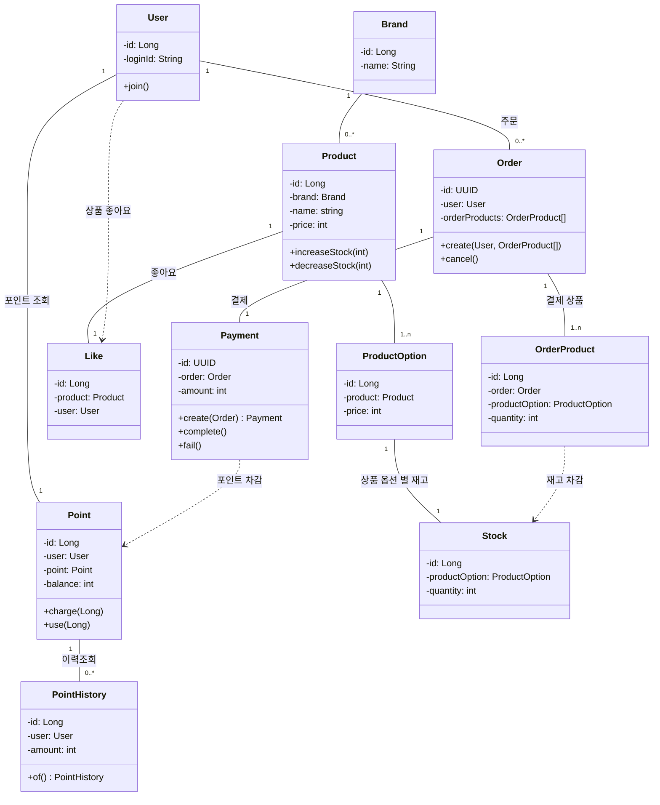

# 클래스 다이어그램

---

```mermaid
classDiagram
    class User {
        -id: Long
        -loginId: String
        
        +join()
    }

    class Point {
        -id: Long
        -user: User
        -point: Point
        -balance: int
        
        +charge(Long)
        +use(Long)
    }

    class PointHistory {
        -id: Long
        -user: User
        -amount: int

        +of() PointHistory
    }

    class Brand {
        -id: Long
        -name: String
    }

    class Product {
        -id: Long
        -brand: Brand
        -name: string
        -price: int
        
        +increaseStock(int)
        +decreaseStock(int)
    }

    class ProductOption {
        -id: Long
        -product: Product
        -price: int
    }

    class Stock {
        -id: Long
        -productOption: ProductOption
        -quantity: int
    }

    class Like {
        -id: Long
        -product: Product
        -user: User
    }

    class Order {
        -id: UUID
        -user: User
        -orderProducts: OrderProduct[]
        
        +create(User, OrderProduct[])
        +cancel()
    }

    class OrderProduct {
        -id: Long
        -order: Order
        -productOption: ProductOption
        -quantity: int
    }

    class Payment {
        -id: UUID
        -order: Order
        -amount: int
        
        +create(Order) Payment
        +complete()
        +fail()
    }

    User "1" -- "0..*" Order: 주문
    User "1" -- "1" Point: 포인트 조회
    Brand "1" -- "0..*" Product
    Product "1" -- "1..n" ProductOption
    Product "1" -- "1" Like: 좋아요
    ProductOption "1" -- "1" Stock: 상품 옵션 별 재고
    Point "1" -- "0..*" PointHistory: 이력조회
    Order "1" -- "1..n" OrderProduct: 결제 상품
    Order "1" -- "1" Payment: 결제
    
    User ..> Like: 상품 좋아요
    Payment ..> Point: 포인트 차감
    OrderProduct ..> Stock: 재고 차감
```