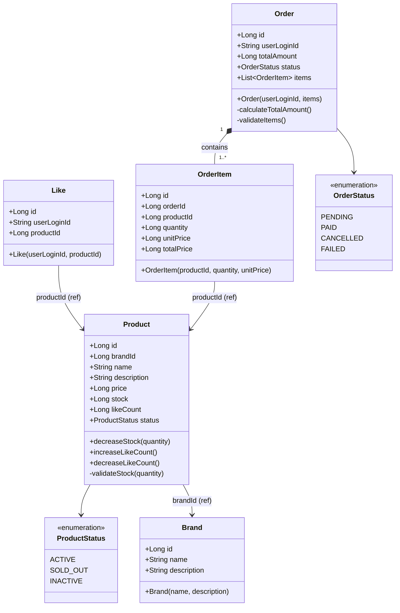

# 03. 클래스 다이어그램 & 도메인 설계

---

## 설계 원칙

- **비즈니스 규칙은 도메인 객체 내부에** 두고, Service는 흐름만 조율한다.
- **단방향 연관관계** 우선: `Like → Product`, `OrderItem → Product` (역방향 참조 불필요)
- **재고 차감(`decreaseStock`)**, **좋아요 수 증감(`increaseLikeCount`)** 등 상태 변이 로직은 엔티티 메서드로 캡슐화
- `Price`는 VO가 아닌 `Long`으로 단순화 (단일 통화 가정)

---

## 전체 클래스 다이어그램



---

## 도메인별 책임 설명

### Brand
- 브랜드 정보(이름, 설명)를 보유
- 상품 등록/관리는 이번 범위 외

### Product
| 메서드 | 책임 |
|--------|------|
| `decreaseStock(quantity)` | 재고 차감. 재고 부족 시 `CoreException(CONFLICT)` |
| `increaseLikeCount()` | 좋아요 수 +1 |
| `decreaseLikeCount()` | 좋아요 수 -1, 0 미만은 방어 |

- `status`가 `INACTIVE`인 상품은 주문 불가 (도메인 규칙)
- 재고 차감은 낙관적 락 or 비관적 락으로 동시성 보호 (구현 시 결정)

### Like
- `(userLoginId, productId)` 쌍이 고유함을 DB unique 제약으로 보장
- 엔티티 자체에 별도 비즈니스 로직 없음 (단순 연결 레코드)

### Order / OrderItem
| 메서드 | 책임 |
|--------|------|
| `Order(userLoginId, items)` | OrderItem 리스트로 총금액 자동 계산 |
| `calculateTotalAmount()` | `sum(item.totalPrice)` |
| `validateItems()` | 빈 리스트 방어 |

- `OrderItem.totalPrice = unitPrice × quantity` (생성 시 고정)
- 주문 생성 후 상품 가격이 변경되어도 주문 금액은 불변

---

## 레이어별 주요 클래스 구조

```
interfaces/api/
  product/
    ProductV1Controller
    ProductV1ApiSpec
    ProductRequest, ProductResponse
  like/
    LikeV1Controller
    LikeV1ApiSpec
    LikeRequest, LikeResponse
  order/
    OrderV1Controller
    OrderV1ApiSpec
    OrderRequest, OrderResponse

application/
  product/  ProductFacade, ProductInput, ProductOutput
  like/     LikeFacade, LikeInput, LikeOutput
  order/    OrderFacade, OrderInput, OrderOutput

domain/
  brand/    Brand, BrandRepository, BrandService, BrandCommand, BrandResult
  product/  Product, ProductRepository, ProductService, ProductCommand, ProductResult
  like/     Like, LikeRepository, LikeService, LikeCommand, LikeResult
  order/    Order, OrderItem, OrderRepository, OrderService, OrderCommand, OrderResult
            ExternalOrderClient (interface)

infrastructure/
  brand/    BrandJpaRepository, BrandRepositoryImpl
  product/  ProductJpaRepository, ProductRepositoryImpl
  like/     LikeJpaRepository, LikeRepositoryImpl
  order/    OrderJpaRepository, OrderItemJpaRepository, OrderRepositoryImpl
            ExternalOrderClientImpl (Mock)
```
