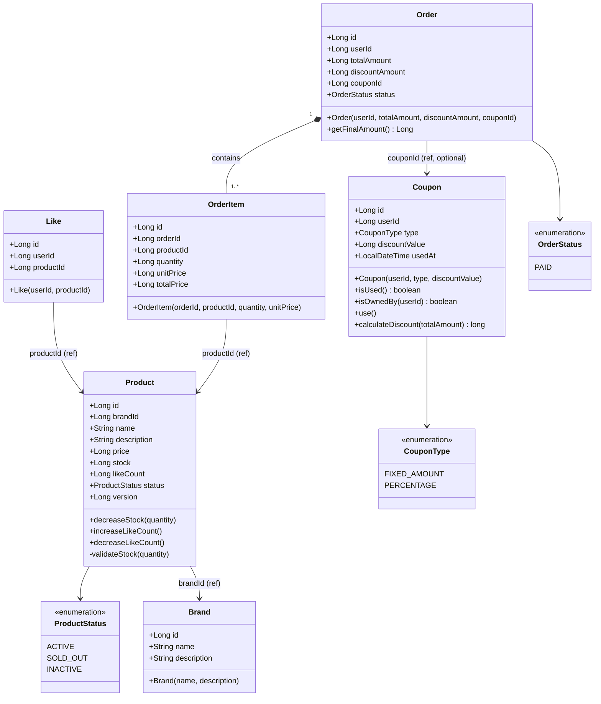

# 03. 클래스 다이어그램 & 도메인 설계

---

## 설계 원칙

- **비즈니스 규칙은 도메인 객체 내부에** 두고, Service는 흐름만 조율한다.
- **단방향 연관관계** 우선: `Like → Product`, `OrderItem → Product` (역방향 참조 불필요)
- **재고 차감(`decreaseStock`)**, **좋아요 수 증감(`increaseLikeCount`)** 등 상태 변이 로직은 엔티티 메서드로 캡슐화
- `Price`는 VO가 아닌 `Long`으로 단순화 (단일 통화 가정)
- **유저 식별**: `X-USER-ID` 헤더는 `Long userId` (숫자 ID)를 사용한다. 다른 엔티티에서 유저를 참조할 때는 `ref_user_id` 컬럼(FK)으로 연결한다.

---

## 전체 클래스 다이어그램



---

## 도메인별 책임 설명

### Brand
- 브랜드 정보(이름, 설명)를 보유
- 상품 등록/관리는 이번 범위 외

### Product
| 메서드 | 책임 |
|--------|------|
| `decreaseStock(quantity)` | 재고 차감. 재고 부족 시 `CoreException(CONFLICT)` |
| `increaseLikeCount()` | 좋아요 수 +1 |
| `decreaseLikeCount()` | 좋아요 수 -1, 0 미만은 방어 |

- `status`가 `SOLD_OUT`이 되면 자동 전환 (재고 0 도달 시)
- 재고 차감 및 좋아요 수 변경은 비관적 락으로 동시성 보호

### Like
- `(userId, productId)` 쌍이 고유함을 DB unique 제약으로 보장
- 엔티티 자체에 별도 비즈니스 로직 없음 (단순 연결 레코드)

### Coupon
| 메서드 | 책임 |
|--------|------|
| `isUsed()` | `usedAt != null`이면 사용 완료 |
| `isOwnedBy(userId)` | 요청자 소유 검증 |
| `use()` | 이미 사용된 쿠폰이면 `CoreException(CONFLICT)`, 아니면 `usedAt` 기록 |
| `calculateDiscount(totalAmount)` | `FIXED_AMOUNT`: min(discountValue, totalAmount), `PERCENTAGE`: totalAmount × discountValue / 100 |

- 쿠폰 사용은 비관적 락으로 중복 사용 방지

### Order / OrderItem
| 메서드 | 책임 |
|--------|------|
| `Order(userId, totalAmount, discountAmount, couponId)` | 주문 생성, 상태 PAID로 초기화 |
| `getFinalAmount()` | `totalAmount - discountAmount` |
| `OrderItem(orderId, productId, quantity, unitPrice)` | 생성 시 `totalPrice = quantity × unitPrice` 고정 |

- 주문 생성 후 상품 가격이 변경되어도 주문 금액은 불변 (unit_price 스냅샷)
- 쿠폰이 없으면 `discountAmount = 0`, `couponId = null`

---

## 레이어별 주요 클래스 구조

```
interfaces/api/
  product/
    ProductV1Controller
    ProductV1ApiSpec
    ProductRequest, ProductResponse
  like/
    LikeV1Controller
    LikeV1ApiSpec
    LikeResponse
  order/
    OrderV1Controller
    OrderV1ApiSpec
    OrderRequest, OrderResponse

application/
  product/  ProductFacade, ProductInput, ProductOutput
  like/     LikeFacade, LikeInput, LikeOutput
  order/    OrderFacade, OrderInput, OrderOutput
  point/    PointFacade, PointInput, PointOutput

domain/
  brand/    Brand, BrandRepository, BrandService, BrandCommand, BrandResult
  product/  Product, ProductRepository, ProductService, ProductCommand, ProductResult
  like/     Like, LikeRepository, LikeService, LikeCommand, LikeResult
  coupon/   Coupon, CouponRepository, CouponService, CouponCommand, CouponResult
  order/    Order, OrderItem, OrderRepository, OrderService, OrderCommand, OrderResult
            ExternalOrderClient (interface)
  point/    Point, PointHistory, PointRepository, PointService, PointCommand, PointResult

infrastructure/
  brand/    BrandJpaRepository, BrandRepositoryImpl
  product/  ProductJpaRepository, ProductRepositoryImpl
  like/     LikeJpaRepository, LikeRepositoryImpl
  coupon/   CouponJpaRepository, CouponRepositoryImpl
  order/    OrderJpaRepository, OrderItemJpaRepository, OrderRepositoryImpl
            ExternalOrderClientImpl (Mock)
  point/    PointJpaRepository, PointHistoryJpaRepository, PointRepositoryImpl
```
