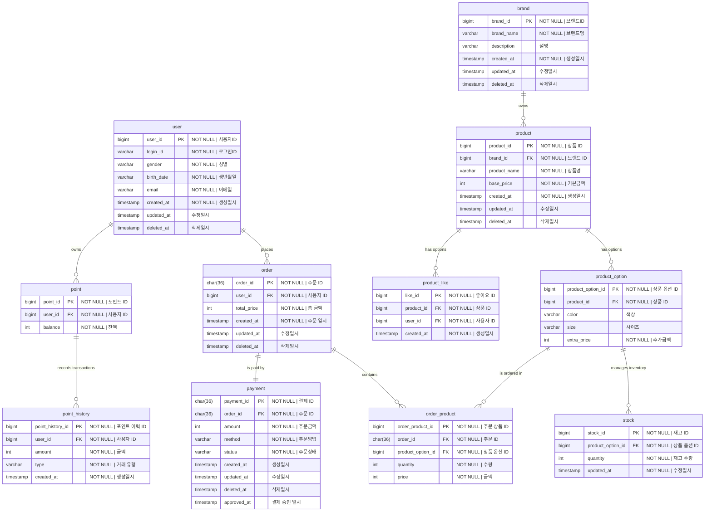

# ERD

--- 

```mermaid
erDiagram
    user {
        bigint user_id PK "NOT NULL | 사용자ID"
        varchar login_id "NOT NULL | 로그인ID"
        varchar gender "NOT NULL | 성별"
        varchar birth_date "NOT NULL | 생년월일"
        varchar email "NOT NULL | 이메일"
        timestamp created_at "NOT NULL | 생성일시"
        timestamp updated_at "수정일시"
        timestamp deleted_at "삭제일시"
    }

    point {
        bigint point_id PK "NOT NULL | 포인트 ID"
        bigint user_id FK "NOT NULL | 사용자 ID"
        int balance "NOT NULL | 잔액"
    }

    point_history {
        bigint point_history_id PK "NOT NULL | 포인트 이력 ID"
        bigint user_id FK "NOT NULL | 사용자 ID"
        int amount "NOT NULL | 금액"
        varchar type "NOT NULL | 거래 유형"
        timestamp created_at "NOT NULL | 생성일시"
    }

    brand {
        bigint brand_id PK "NOT NULL | 브랜드ID"
        varchar brand_name "NOT NULL | 브랜드명"
        varchar description "설명"
        timestamp created_at "NOT NULL | 생성일시"
        timestamp updated_at "수정일시"
        timestamp deleted_at "삭제일시"
    }

    product {
        bigint product_id PK "NOT NULL | 상품 ID"
        bigint brand_id FK "NOT NULL | 브랜드 ID"
        varchar product_name "NOT NULL | 상품명"
        int base_price "NOT NULL | 기본금액"
        timestamp created_at "NOT NULL | 생성일시"
        timestamp updated_at "수정일시"
        timestamp deleted_at "삭제일시"
    }

    product_option {
        bigint product_option_id PK "NOT NULL | 상품 옵션 ID"
        bigint product_id FK "NOT NULL | 상품 ID"
        varchar color "색상"
        varchar size "사이즈"
        int extra_price "NOT NULL | 추가금액"
    }

    stock {
        bigint stock_id PK "NOT NULL | 재고 ID"
        bigint product_option_id FK "NOT NULL | 상품 옵션 ID"
        int quantity "NOT NULL | 재고 수량"
        timestamp updated_at "NOT NULL | 수정일시"
    }

    product_like {
        bigint like_id PK "NOT NULL | 좋아요 ID"
        bigint product_id FK "NOT NULL | 상품 ID"
        bigint user_id FK "NOT NULL | 사용자 ID"
        timestamp created_at "NOT NULL | 생성일시"
    }

    order {
        char(36) order_id PK "NOT NULL | 주문 ID"
        bigint user_id FK "NOT NULL | 사용자 ID"
        int total_price "NOT NULL | 총 금액"
        timestamp created_at "NOT NULL | 주문 일시"
        timestamp updated_at "수정일시"
        timestamp deleted_at "삭제일시"
    }

    order_product {
        bigint order_product_id PK "NOT NULL | 주문 상품 ID"
        char(36) order_id FK "NOT NULL | 주문 ID"
        bigint product_option_id FK "NOT NULL | 상품 옵션 ID"
        int quantity "NOT NULL | 수량"
        int price "NOT NULL | 금액"
    }

    payment {
        char(36) payment_id PK "NOT NULL | 결제 ID"
        char(36) order_id FK "NOT NULL | 주문 ID"
        int amount "NOT NULL | 주문금액"
        varchar method "NOT NULL | 주문방법"
        varchar status "NOT NULL | 주문상태"
        timestamp created_at "생성일시"
        timestamp updated_at "수정일시"
        timestamp deleted_at "삭제일시"
        timestamp approved_at "결제 승인 일시"
    }

    user ||--o{ point: "owns"
    user ||--o{ order: "places"
    brand ||--o{ product: "owns"
    product ||--o{ product_option: "has options"
    product ||--o{ product_like: " has options"
    product_option ||--o{ stock: "manages inventory"
    product_option ||--o{ order_product: "is ordered in"
    order ||--o{ order_product: "contains"
    order ||--|| payment: "is paid by"
    point ||--o{ point_history: "records transactions"
```