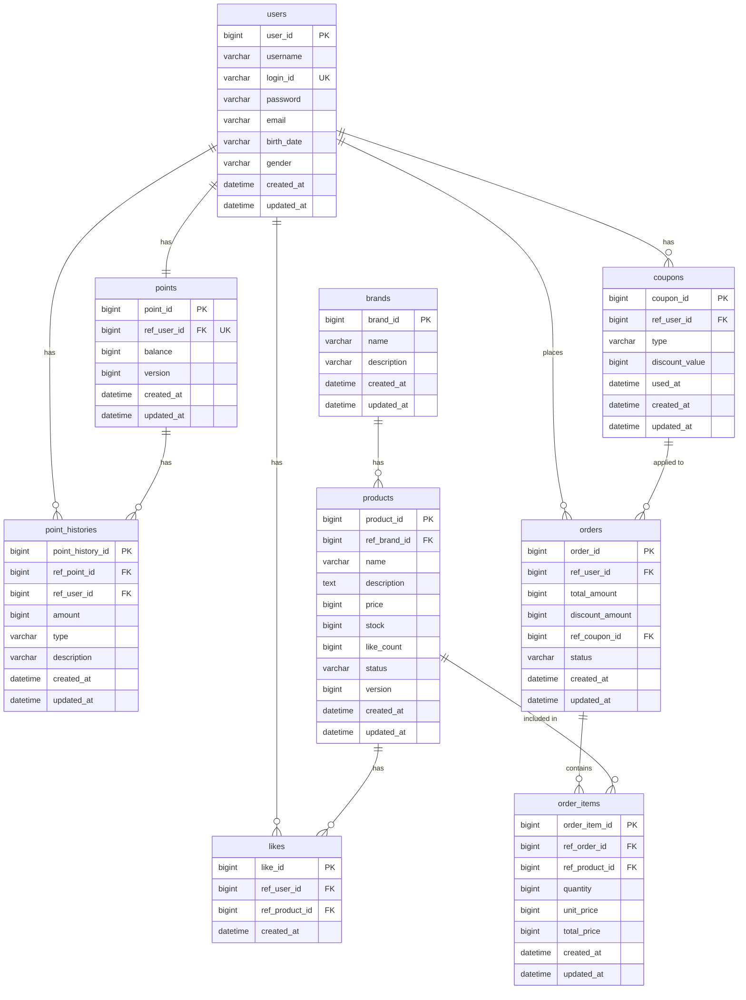

# 04. ERD (Entity Relationship Diagram)

---

## 전체 ERD

---

## 테이블 상세 설명

### users (기존)
| 컬럼 | 타입 | 제약 | 설명 |
|------|------|------|------|
| user_id | BIGINT | PK, AUTO_INCREMENT | |
| login_id | VARCHAR(10) | UNIQUE, NOT NULL | 영문+숫자 10자 이내 |
| username | VARCHAR(50) | NOT NULL | 닉네임 |
| password | VARCHAR(255) | NOT NULL | |
| email | VARCHAR(255) | NOT NULL | xx@yy.zz 형식 |
| birth_date | VARCHAR(10) | NOT NULL | yyyy-MM-dd 형식 |
| gender | VARCHAR(10) | NOT NULL | MALE / FEMALE |

### brands
| 컬럼 | 타입 | 제약 | 설명 |
|------|------|------|------|
| brand_id | BIGINT | PK, AUTO_INCREMENT | |
| name | VARCHAR(100) | NOT NULL | 브랜드명 |
| description | TEXT | | 브랜드 설명 |

### products
| 컬럼 | 타입 | 제약 | 설명 |
|------|------|------|------|
| product_id | BIGINT | PK, AUTO_INCREMENT | |
| ref_brand_id | BIGINT | FK (brands.brand_id), NOT NULL | |
| name | VARCHAR(200) | NOT NULL | 상품명 |
| description | TEXT | | 상품 설명 |
| price | BIGINT | NOT NULL | 판매 가격 (원) |
| stock | BIGINT | NOT NULL, DEFAULT 0 | 재고 수량 |
| like_count | BIGINT | NOT NULL, DEFAULT 0 | 좋아요 수 (denormalized) |
| status | VARCHAR(20) | NOT NULL | ACTIVE / SOLD_OUT / INACTIVE |
| version | BIGINT | NOT NULL, DEFAULT 0 | 낙관적 락 버전 |

> **설계 고려사항**: `like_count`를 Like 테이블에서 COUNT(*) 쿼리로 실시간 집계하지 않고
> Product 테이블에 비정규화 컬럼으로 유지한다. 조회 성능과 쓰기 정합성의 트레이드오프 중
> 조회 빈도가 압도적으로 높은 이커머스 특성을 감안해 비정규화를 선택했다.

### likes
| 컬럼 | 타입 | 제약 | 설명 |
|------|------|------|------|
| like_id | BIGINT | PK, AUTO_INCREMENT | |
| ref_user_id | BIGINT | FK (users.user_id), NOT NULL | |
| ref_product_id | BIGINT | FK (products.product_id), NOT NULL | |
| created_at | DATETIME | NOT NULL | |

- `(ref_user_id, ref_product_id)` UNIQUE 제약으로 중복 좋아요 방지
- 좋아요 취소 시 hard delete (soft delete 불필요 - 비즈니스 의미 없음)
- `updated_at` 불필요 (변경 사항이 없는 단순 연결 레코드)

### coupons
| 컬럼 | 타입 | 제약 | 설명 |
|------|------|------|------|
| coupon_id | BIGINT | PK, AUTO_INCREMENT | |
| ref_user_id | BIGINT | FK (users.user_id), NOT NULL | 쿠폰 소유자 |
| type | VARCHAR(20) | NOT NULL | FIXED_AMOUNT / PERCENTAGE |
| discount_value | BIGINT | NOT NULL | 정액(원) 또는 정률(%) 할인 값 |
| used_at | DATETIME | | NULL이면 미사용, 값이 있으면 사용 완료 |

> **설계 고려사항**: `used_at` 컬럼 하나로 사용 여부와 사용 시각을 동시에 관리한다.
> 쿠폰 중복 사용 방지는 비관적 락(Pessimistic Lock)으로 처리한다.

### orders
| 컬럼 | 타입 | 제약 | 설명 |
|------|------|------|------|
| order_id | BIGINT | PK, AUTO_INCREMENT | |
| ref_user_id | BIGINT | FK (users.user_id), NOT NULL | |
| total_amount | BIGINT | NOT NULL | 쿠폰 적용 전 총금액 |
| discount_amount | BIGINT | NOT NULL, DEFAULT 0 | 쿠폰 할인 금액 |
| ref_coupon_id | BIGINT | FK (coupons.coupon_id), NULL 허용 | 적용된 쿠폰 (없으면 NULL) |
| status | VARCHAR(20) | NOT NULL | PAID |

> **설계 고려사항**: `total_amount - discount_amount`가 실제 차감 포인트(finalAmount)이며,
> 이 값은 DB에 저장하지 않고 매번 계산한다.

### order_items
| 컬럼 | 타입 | 제약 | 설명 |
|------|------|------|------|
| order_item_id | BIGINT | PK, AUTO_INCREMENT | |
| ref_order_id | BIGINT | FK (orders.order_id), NOT NULL | |
| ref_product_id | BIGINT | FK (products.product_id), NOT NULL | |
| quantity | BIGINT | NOT NULL | 주문 수량 |
| unit_price | BIGINT | NOT NULL | 주문 시점 단가 (스냅샷) |
| total_price | BIGINT | NOT NULL | unit_price × quantity |

> **설계 고려사항**: `unit_price`를 주문 시점에 스냅샷으로 저장한다.
> 이후 상품 가격 변경이 과거 주문에 영향을 주지 않도록 하기 위함.

---

## 인덱스 설계

| 테이블 | 인덱스 | 이유 |
|--------|--------|------|
| products | `(ref_brand_id)` | 브랜드 필터 조회 |
| products | `(status, like_count)` | 좋아요순 정렬 |
| products | `(status, price)` | 가격순 정렬 |
| products | `(status, created_at)` | 최신순 정렬 (기본값) |
| likes | `(ref_user_id)` | 유저별 좋아요 목록 조회 |
| likes | `UNIQUE (ref_user_id, ref_product_id)` | 중복 방지 + 존재 여부 조회 |
| orders | `(ref_user_id, created_at DESC)` | 유저별 주문 목록 최신순 |
| order_items | `(ref_order_id)` | 주문 상세 조회 시 항목 로드 |
